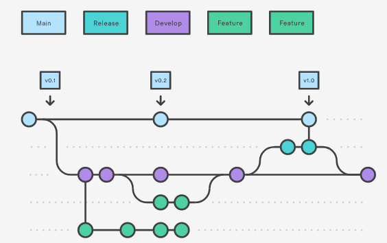
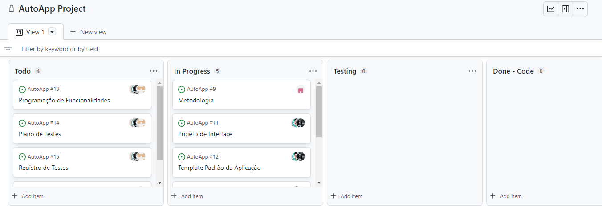

# Metodologia

A metodologia contempla as definições de ferramentas utilizadas pela equipe tanto para a manutenção dos códigos e demais artefatos quanto para a organização do time na execução das tarefas do projeto.

Para controle do projeto, das pessoas e das tarefas, utilizaremos poucos ambientes de trabalho, a fim de reduzir/anular as possibilidades de redundância ou ausência de informações em determinados ambientes, focando sempre nos nossos requisitos funcionais.

Nossa ferramenta principal para gerir os tópicos citados acima, será o GitHub, que utilizaremos na sua forma típica de repositório, armazenando toda manutenção dos códigos. Paralelo a esta modalidade de repositório, também será usado para os gerenciamentos de backlog do produto, e das sprints individualizadas, este gerenciamento será feito através da aba “Project”.

Para arquivos visuais e sonoros, bem como, formulários de pesquisas, análises de requisitos, casos de uso, utilizaremos o Google Drive para a equipe envolvida no desenvolvimento da aplicação, seja por meio da forma técnica ou gerencial e MS Project.

O Projeto de interface e wireframes foi desenvolvido no site Figma, criado de forma que qualquer eventual alteração ou incrementação seja feita de forma prática.

## Controle de Versão
A gestão de código fonte ou controle de versões diz respeito ao monitoramento e gerenciamento das alterações no código, de preferência com histórico de execuções de desenvolvimento e, também, auxilia na resolução de conflitos e reverte versões anteriores de um projeto, quando necessário. Esse componente é essencial para o processo de desenvolvimento do software. 

Com isso, para gestão do código fonte utilizaremos o Git Flow, um modelo de organização de branches, o qual dita que tipos de ramificações configurar e como fazer merge. Desta forma, todas as manutenções no código são realizadas em branches separados, identificados como Main, Hotfix, Release, Develop e Feature, ou seja, um modelo de ramificação de manutenção que permite corrigir com rapidez lançamentos de produção mantendo uma linha de desenvolvimento dedicada para atualização de segurança, permitindo que a equipe trabalhe com problemas sem interromper o fluxo do trabalho ou esperar o próximo ciclo de lançamento. 

 
 
 **Figura 1 - Fluxo de controle do código fonte no repositório github**  

 

**Main**: branch principal, somente versão de produção; 

**Hotfix**:  branch de correção: responsável pela realização de alguma correção crítica encontrada em produção; 

**Release**: branch de lançamento: utilizada como ambiente de homologação e é removida após realizar os testes e do merge com a Main. Caso haja alguma alteração, ela também deve ser sincronizada com a Develop; 

**Develop**: branch criada a partir da branch main, contém código em nível preparatório para o próximo deploy/versão. Ou seja, quando features são terminadas, elas são juntadas com a branch develop, testadas e somente depois as atualizações da branch develop passam por mais um processo para então ser juntadas com a branch main; 

**Feature**: branch de melhorias: utiliza-se para o desenvolvimento de uma funcionalidade específica/nova, inicia-se com a palavra feature e são criadas sempre a partir da branch develop. Exemplo: feature/cadastro;

**Screen**: branch de criação de telas da aplicação.

O projeto segue a seguinte convenção para o nome de branches:

- `main`: versão estável já testada do software
- `unstable`: versão já testada do software, porém instável
- `stating`: versão em testes do software
- `feature`: versão de desenvolvimento do software
- `screen`: versão inicial da tela desenvolvida
- 
Quanto à gerência de issues, o projeto adota a seguinte convenção para
etiquetas:

- `documentation`: melhorias ou acréscimos à documentação
- `bug`: uma funcionalidade encontra-se com problemas
- `enhancement`: indica novas solicitações de recurso ou uma funcionalidade precisa ser melhorada 
- `question`: indica que um problema, pull request ou discussão precisa de mais informações 

 
A seguir, ilustramos a execução do GitFlow da segunda etapa deste projeto.
 
 

A partir da branch main, novas branches foram criadas para o desenvolvimento de componentes e telas da aplicação. Em seguida, as branches foram revisadas e mescladas (merge) para a branch dev, que, por fim, foi mesclada para a branch main.

## Gerenciamento de Projeto

### Divisão de Papéis

A equipe AutoApp utiliza métodos ágeis como metodologia de trabalho de acompanhamento do projeto. O método Scrum foi definido como base do processo de desenvolvimento. A equipe está organizada da seguinte maneira:

-	Product Owner (P.O.): Will Ricardo dos Santos Machado;
-	Scrum Master: Renata Diniz Guimarães de Oliveira;
-	Equipe de Desenvolvimento: Cristiano Garcia Ridolfi, Kelly Cesário de Oliveira, Luís Galdino de Almeida da Silva, Michelle Leal Rodrigues, Pedro Daniel Jardim, 
Renata Diniz Guimarães de Oliveira;
-	Equipe de Design: Kelly Cesário de Oliveira, Luís Galdino de Almeida da Silva, Michelle Leal Rodrigues.

A equipe trabalhará com divisões de tarefas e com encontros semanais após reunião com o P.O. para planejar e tirar dúvidas a respeito das tarefas delegadas.
Na primeira reunião de cada etapa, as tarefas serão organizadas e distribuídas.
Na segunda-feira que precede a entrega da etapa, a equipe irá se se reunir para revisar e alinhar se o que foi solicitado está pronto para ser entregue.
A Scrum Master acompanhará estas sprints (tarefas) diariamente.

O projeto seguirá o seguinte fluxo de metodologia:

Utilizando essa metodologia, prevê-se ter uma maior produtividade, melhoria na comunicação, maior qualidade, integração entre os integrantes, respostas a imprevistos.

### Processo

Para organização e distribuição das tarefas do projeto, a equipe utilizará o Projects (ferramenta do github), onde foi elaborado um Quadro Kanban que estrutura o desenvolvimento nas seguintes colunas:

**To Do:** Nessa coluna, estão alocadas as tarefas estabelecidas para a Sprint atual e que ainda não foram iniciadas, assim como os membros da equipe responsáveis por cada item.  

**In progress:** Tarefas que já foram iniciadas mas ainda não finalizadas, são acompanhadas rotineiramente seguindo os ritos da metodologia ágil. 

**Test:** Tarefas iniciadas e finalizadas, passam por validações de negócio e de lógica, assim preservando um controle de qualidade e evitando que aconteça bugs inesperados. 

**Test Return:** Coluna para sinalizar tarefas que de alguma maneira não passaram no teste de qualidade e sendo necessário um retrabalho para passar no teste de qualidade. 

**Waiting Deploy:** Quando uma tarefa tiver sido iniciada e finalizada, é movida para a coluna de waiting deploy, para que o responsável revise o código feito e aprove para as branch de teste. 

**Done:** Tarefas concluídas e aprovadas no teste de qualidade.

O quadro kanban do projeto no Github está disponível em Projects e é apresentado, no estado atual, na Figura 2.

 
 
 **Figura 2 - Quadro Kanban no dia 27/09/2022**  

### Ferramentas

Os artefatos do projeto serão desenvolvidos a partir de duas plataformas: GitHub e Figma. 
A relação dos ambientes com sua respectiva plataforma é apresentada na tabela abaixo:

|Ambiente    |Plataforma          |
|------------|--------------------|
|Repositório de código fonte |[Github](https://github.com) |
|Documentos do projeto | [Github](https://github.com) |
|Projeto de Interface e  Wireframes| [Figma](https://www.figma.com) |
|Gerenciamento do Projeto | [Github](https://github.com) e [MSProject2013] |
|Modelagem de Processos | BPMN.iO |

A relação das ferramentas empregadas no projeto e suas respectivas funções segue abaixo:

|Função     |Ferramentas          |
|-----------|---------------------|
|Editor de código |Github, Visual Studio Code, Expo go | 
|Ferramentas de comunicação |Github, WhatsApp |
|Ferramentas de diagramação |Figma |
|Ferramentas de modelagem de processos | BPMN.iO |
|Ferramentas de gestão de projetos |Github, MSProject2013 |

Os editores de código foram escolhidos por possuírem uma integração com o sistema de versão e maior possibilidade de integração da equipe na elaboração dos códigos. As ferramentas de comunicação utilizadas possuem integração semelhante e por isso foram selecionadas, facilitando o contato interno entre os membros da equipe e o contato externo da equipe com o orientador do projeto. Por fim, para criar diagramas e executar a modelagem de processos, as ferramentas utilizada foram selecionadas por melhor captar as necessidades da solução e proporcionar uma melhor visualização do produto final, alémm de serem ambientes colaborativos para a atuação simultânea da equipe.
