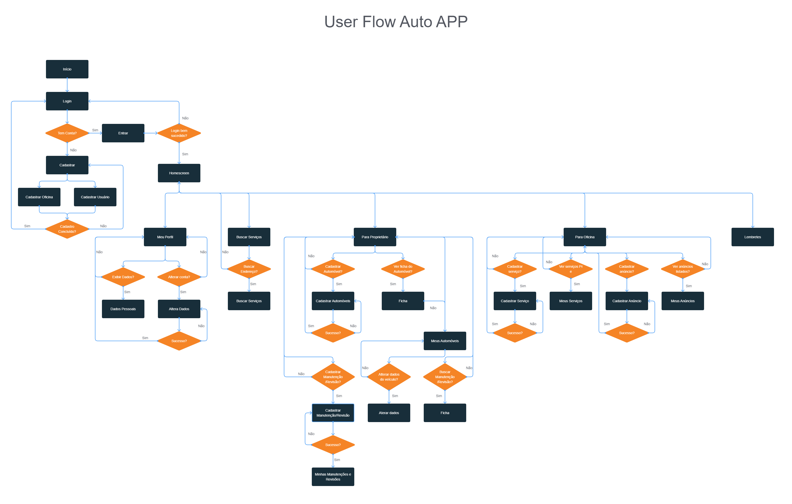
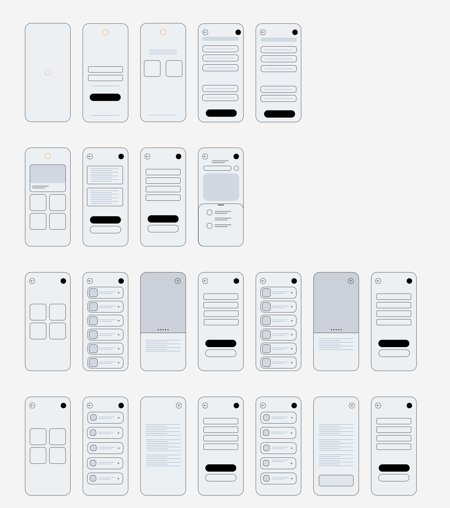
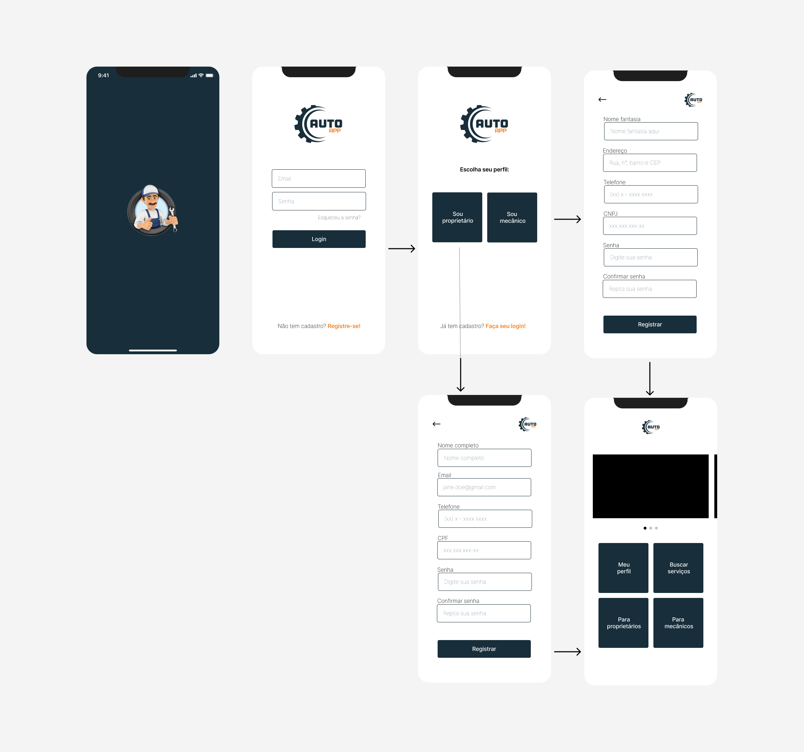
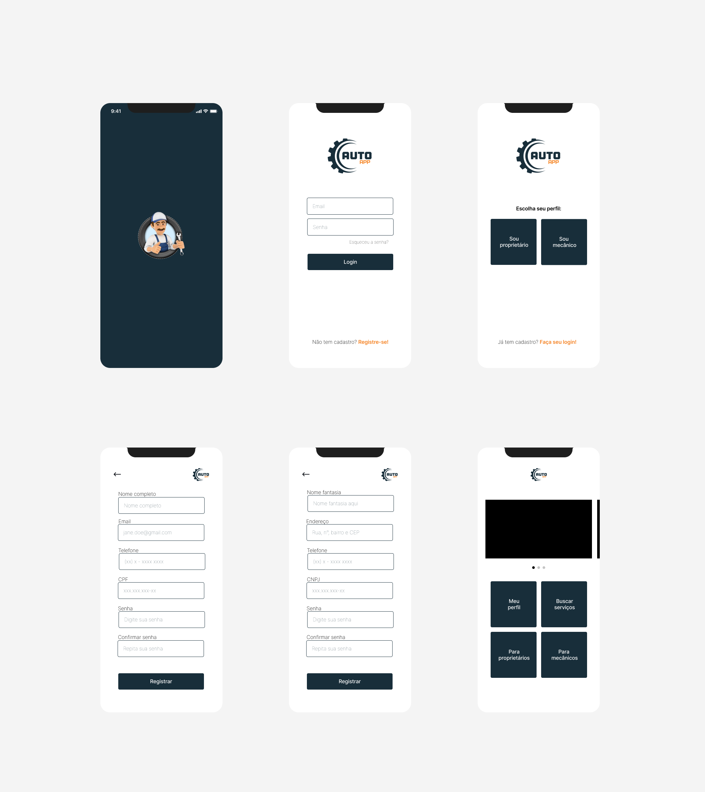
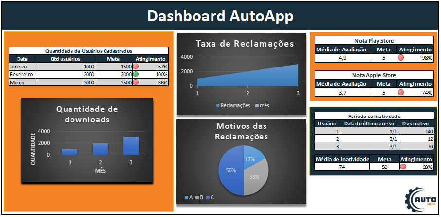

# Projeto de Interface

Pré-requisitos: <a href="https://github.com/ICEI-PUC-Minas-PMV-ADS/AutoApp/blob/0345c562979ead6378dba6dbabd9690c1ba18b69/docs/02-Especifica%C3%A7%C3%A3o%20do%20Projeto.md"> Documentação de Especificação</a>

Visão geral da interação do usuário pelas telas do sistema e protótipo interativo das telas com as funcionalidades que fazem parte do sistema (wireframes).

## Diagrama de Fluxo

O diagrama apresenta o estudo do fluxo de interação do usuário com o sistema interativo e  muitas vezes sem a necessidade do desenho do design das telas da interface. Isso permite que o design das interações seja bem planejado e gere impacto na qualidade no design do wireframe interativo que será desenvolvido logo em seguida.

Também é possível visualizar o [diagrama de fluxo em PDF](pdf/fluxograma.pdf).

## Wireframes

São protótipos usados em design de interface para sugerir a estrutura de um site web e seu relacionamentos entre suas páginas. Um wireframe web é uma ilustração semelhante do layout de elementos fundamentais na interface.

### Wireframe Protótipo

A imagem a seguir ilustra o wireframe protótipo da aplicação completa.

### Wireframe Telas Reais

A imagem a seguir ilustra o wireframe com imagens das telas reais das seis primeiras telas. O arquivo será atualizado conforme desenvolvimento das demais telas.

## Telas da Aplicação

Na imagem a seguir, apresentamos as telas da aplicação.

# Dashboard com Indicadores de Desempenho e Metas

Ao acessar a aplicação com um perfil de administrador, é possível gerar um dashboard com os dados obtidos na aplicação e externamente, que permite uma visualização rápida dos resultados obtidos em relação as metas, e dos demais indicadores relevantes para o negócio definidos na especificação do projeto.

