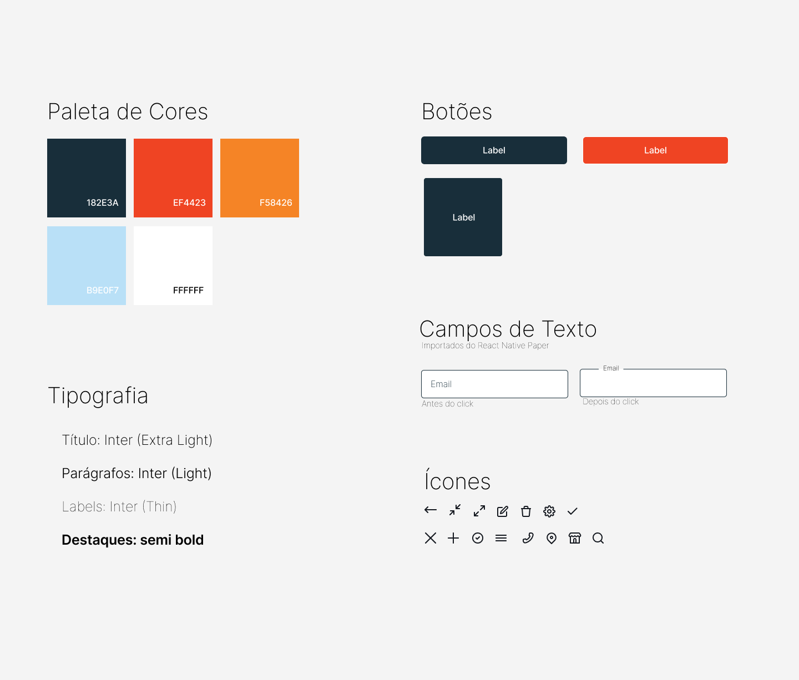

# Template Padrão da Aplicação

Pré-requisitos: <a href="https://github.com/ICEI-PUC-Minas-PMV-ADS/AutoApp/blob/0345c562979ead6378dba6dbabd9690c1ba18b69/docs/02-Especifica%C3%A7%C3%A3o%20do%20Projeto.md"> Especificação do Projeto</a>, <a href="https://github.com/ICEI-PUC-Minas-PMV-ADS/AutoApp/blob/0345c562979ead6378dba6dbabd9690c1ba18b69/docs/04-Projeto%20de%20Interface.md"> Projeto de Interface</a>, <a href="https://github.com/ICEI-PUC-Minas-PMV-ADS/AutoApp/blob/0345c562979ead6378dba6dbabd9690c1ba18b69/docs/03-Metodologia.md"> Metodologia</a>

Layout padrão da aplicação que será utilizado em todas as páginas com a definição de identidade visual, aspectos de responsividade e iconografia.

