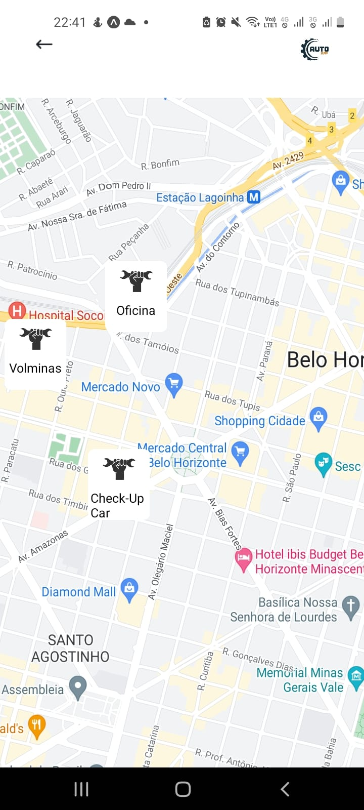

# Registro de Testes de Software

O objetivo deste relatório é indicar se a aplicação AutoApp atende aos requisitos previamente propostos e sugerir possíveis pontos de correção, nesta etapa os testes foram efetuados considerando a tela da aplicação 

  
  
| 1 	| Cadastrar perfil 	|
|:---:	|:---:	|
|	Requisito	| RF-001 - O sistema deverá permitir a criação de um perfil de usuário para o responsável do veículo associado ao seu e-mail. |
| Observação | A aplicação apresenta a funcionalidade de cadastro, que pode ser realizado ao clicar em "Registre-se" e o usuário é direcionado para uma tela para que possa escolher seu tipo de perfil. Em seguida, há o preenchimento de informações cadastrais (e-mail, nome, CPF, por exemplo). No vídeo, apresentamos a tela pronta com a integração com o banco de dados. |
| Tela |  |
| Vídeo | <video src="https://user-images.githubusercontent.com/81396458/204150803-3bc0b695-b74b-49d9-a477-ccfd4ec49188.mp4">  |
|  	|  	|
| 2 | Efetuar login	|
| Requisito | RF-001	- O sistema deverá permitir a criação de um perfil de usuário para o responsável do veículo associado ao seu e-mail. |
| Observação | A aplicação apresenta a funcionalidade de Login. Após o preenchimento dos campos de e-mail e de senha, o usuário é redirecionado para a tela de menu com os serviços da aplicação. No vídeo, apresentamos a tela pronta com a integração com o banco de dados. |
| Tela |  |
| Vídeo | <video src="https://user-images.githubusercontent.com/81396458/204150967-96cc1fac-f3b0-4559-abba-0f8fba1d2df4.mp4">  |
|  	|  	|
| 3 | Verificar a funcionalidade de adicionar veículos no aplicativo |
|Requisito | RF-004 - O sistema deverá permitir a adição de veículos (ano, modelo, placa, etc.), permitindo a exibição de seus dados básicos. |
| Observação | Após realizar login e clicar em "Cadastro de Automóveis", o usuário deve preencher os dados do carro para que este seja registrado em nosso sistema, conforme demonstramos no vídeo a seguir.  |
| Vídeo | <video src="https://user-images.githubusercontent.com/81396458/204151680-9619e1cd-72c0-4ad2-9fed-074bcf596d3f.mp4">  |
|  	|  	|
| 4 |  Verificar os lembretes para os usuários |
|Requisito | RF-008 - O sistema deve emitir lembretes para os usuários.|
| Observação | A emissão de lembretes é disponibilizada por meio de um carousel de imagens. |
| Tela |  |
| Vídeo | <video src="https://user-images.githubusercontent.com/81396458/204151021-ebb90010-f3e7-48e5-bb49-fe73f45a3a76.mp4">  |
|  	|  	|
| 5 | Verificar alteração e exclusão de dados |
|Requisitos | RF-002 - O sistema deverá permitir a alteração e a exclusão dos dados de usuários, nesse caso, excluindo também qualquer veículo vinculado a ele.   RF-007 -  O sistema deverá permitir a edição e a exclusão dos dados do veículo. |
| Observação | No vídeo, apresentamos a tela pronta com a integração com o banco de dados. |
| Tela |  |
| Vídeo 1 | <video src="https://user-images.githubusercontent.com/81396458/204151039-925e2178-5ffe-4e9e-a0e2-6e55bcc8a18c.mp4">  |
| Vídeo 2 | <video src="https://user-images.githubusercontent.com/81396458/204151155-5b96df8c-1a4f-4117-bc21-831d139e45e4.mp4">  |
|  	|  	|
| 6 | Verificar a inserção de manutenções realizadas |
|Requisito | RF-005 - O sistema deverá armazenar os dados de revisões e de manutenções efetuadas no veículo. |
| Observação | A aplicação conta com o armazenamento de manutenções realizadas como um histórico de cuidado do carro. No vídeo, apresentamos a tela pronta com a integração com o banco de dados. |
| Tela  |  |
| Vídeo | <video src="https://user-images.githubusercontent.com/81396458/204151090-eb6f7940-b8a8-4d21-92b9-f947fc55ddda.mp4">  |
|  	|  	|
| 7 | Verificar a inserção serviços prestados |
|Requisito | RF-003 - O sistema deverá permitir a inserção, a alteração e a exclusão dos dados de prestadores de serviços afiliados. |
| Observação | A aplicação conta com o registro de serviços prestados para que estes sejam anúnciados. No vídeo, apresentamos a tela pronta com a integração com o banco de dados. |
| Tela |  |
| Vídeo | <video src="https://user-images.githubusercontent.com/81396458/204151107-b78213f2-c81c-4f13-a723-5d8ab4ba2cdb.mp4">  |
|  	|  	|
| 8 | Buscar Serviços |
|Requisito | RF-009 - O sistema deverá permitir a busca de oficinas conveniadas próximas a sua localidade. |
| Observação | A aplicação mostra o mapa, com endereço por enquanto fixo, definido em Belo Horizonte e mostra 3 oficinas cadastradas. Ainda falta a opção de pesquisar e o reconhecimento da geolocalização do usuário |
| Tela |  |
| Vídeo | <video src="">  |
|  	|  	|
