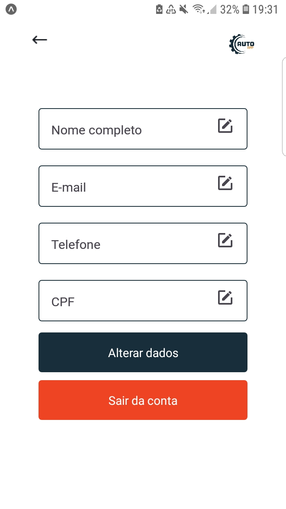
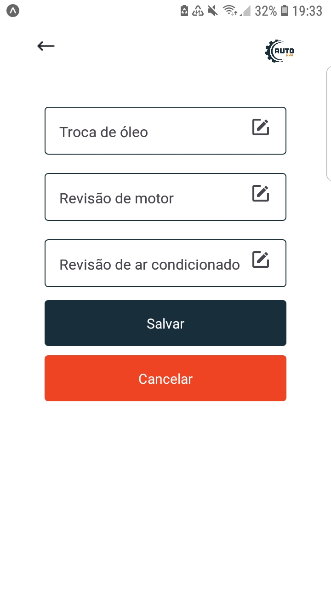

# Registro de Testes de Software

O objetivo deste relatório é indicar se a aplicação AutoApp atende aos requisitos previamente propostos e sugerir possíveis pontos de correção, nesta etapa os testes foram efetuados considerando a tela da aplicação 

  
  
| 1 	| Cadastrar perfil 	|
|:---:	|:---:	|
|	Requisito	| RF-001 - O sistema deverá permitir a criação de um perfil de usuário para o responsável do veículo associado ao seu e-mail. |
| Observação | Na página inicial, a aplicação apresenta a funcionalidade de cadastro, este que pode ser realizado ao clicar em "Registre-se" e o usuário é direcionado para uma tela para que possa escolher seu Perfil. Após o preenchimento de informações cadastrais (e-mail, nome, CPF, por exemplo). As telas estão prontas, com os botões com cliques mas os direcionamentos e vinculos com banco de dados ainda não . |
| Tela X |  |
|  	|  	|
| 2 | Efetuar login	|
| Requisito | RF-001	- O sistema deverá permitir a criação de um perfil de usuário para o responsável do veículo associado ao seu e-mail.. |
| Observação | Também na página inicial, a aplicação apresenta a funcionalidade de login. Após o preenchimento dos campos de e-mail e senha o usuário é redirecionado para a tela de menu com os serviços da aplicação. A tela está pronta, com os botões com cliques mas os direcionamentos e vinculos com banco de dados ainda não. |
| Tela X |  |
|  	|  	|
| 3 | Verificar a funcionalidade de criar um perfil de veículo no app |
|Requisito | RF-004 - O sistema deverá permitir a criação de um perfil para o veículo (ano, modelo, cor...), permitindo a exibição de seus dados básicos.|
| Observação | A aplicação Depois de logar o usuário possui um menu com as opções de criar um perfil para seu veículo e outras como Buscar serviços e seleção do tipo de usuário. A tela está pronta, com os botões com cliques mas os direcionamentos e vinculos com banco de dados ainda não.|
| Tela X |  |
|  	|  	|
| 4 |  Verificar os lembretes para os usuários |
|Requisito | RF-008 - O sistema deve emitir lembretes para os usuários, com base nos dados informados no RF-005.|
| Observação | |
| Tela X |  |
|  	|  	|
| 5 | Verificar alteração de dados |
|Requisitos | RF-002 - O sistema deverá permitir a alteração e a exclusão dos dados de usuários, nesse caso, excluindo também qualquer veículo vinculado a ele.   RF-007 - O sistema deverá permitir a edição e exclusão dos dados do veículo.|
| Observação | |
| Tela X |  |
|  	|  	|
| 6 | Verificar a inserção de manutenções realizadas |
|Requisito | RF-005 - O sistema deverá armazenar os dados de revisões e de manutenções efetuadas no veículo.|
| Observação | |
| Tela X |  |
|  	|  	|
| 7 | Verificar a inserção serviços prestados |
|Requisito | RF-003 - O sistema deverá permitir a inserção, a alteração e a exclusão dos dados de prestadores de serviços afiliados. |
| Observação | |
| Tela X |  |
|  	|  	|

